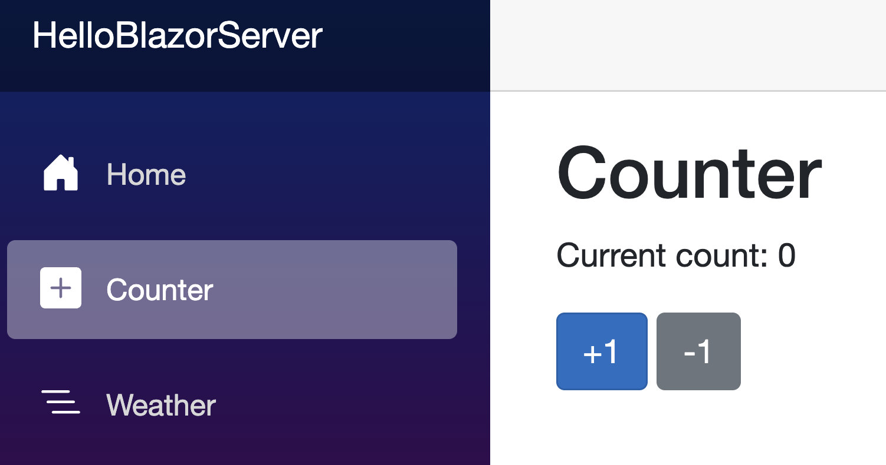
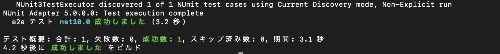
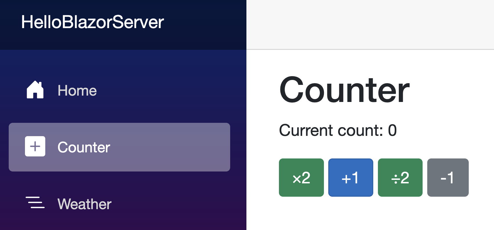
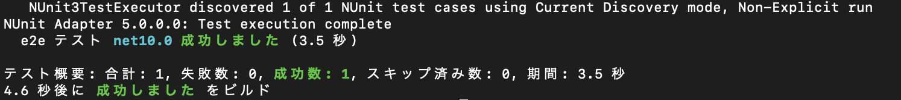

### モチベーション
最近、自然言語ベースのE2Eテストサービスの話を聞いている時にコードベースのE2Eテストと比較される場面があったんですが、現状のコードベースのE2Eテストの理解が曖昧で内容が咀嚼できないことがあったので、お勉強したログです。
今回のブログでは、コードベースでE2Eテストできるものとして最もメジャーであろうPlayWrightを題材とします。

## 座学

理解が甘い部分は、コードベースのE2Eテストを利用する前提において、ユーザが操作する画面に変更が入った時のE2Eテストへの影響です。
これには、テストする時の各要素へのロケータが直結すると思ったので、主にロケータについて学びました。

### Playwrightのロケータ

Playwrightの[ロケータに関するDocs](https://playwright.dev/docs/locators)を参照したところ色んなロケータの方法があるようで、以下のように理解しました。

| ロケータ | 説明 |
|---------|-----|
| `Page.GetByRole()` | アクセシビリティ属性で探す |
| `Page.GetByLabel()` | フォーム入力要素の関連ラベルテキストで探す |
| `Page.GetByPlaceholder()` | プレースホルダーテキストで探す |
| `Page.GetByAltText()` | 画像のalt属性で探す |
| `Page.GetByTitle()` | 要素のtitle属性で探す |
| `Page.GetByText()` | テキストコンテンツで探す（div, span等の非インタラクティブ要素） |
| `Page.GetByTestId()` | 指定したテストID属性で探す |

最も堅牢そうなのは `GetByTestId()` のように感じましたが、後からE2Eテストを導入するのはしんどそうなので、基本的には汎用的な`Page.GetByRole()`を利用して、あとは要素によって適宜変えていくものだとイメージしました。

実際の現場では、外部UIライブラリを使うと、アクセシビリティ属性（role, label, aria-*等）が十分に付与されていない、あるいは自動生成されるクラス名や構造が複雑で、`getByRole`や`getByLabel`などの「意味的なロケータ」だけでは要素を特定できないケースが多々あります。
1. まず`getByTestId`（data-testid属性を自分で付与）を検討
2. それも難しい場合は、`locator()`でCSSセレクタやXPathを直接指定
という順で使い分けるのが現実的です。
> **注意:** locator()は強力ですが、UIライブラリのバージョンアップやDOM構造の変更に弱く、
> テストの保守コストが上がるため、まずは意味的ロケータ（getByRole等）→getByTestId→最後の手段としてlocator()の順で使うのが推奨です。

## 実践

読んだだけだと記憶に残らないので、実践してみます。

### 前提

〇〇なので、Microsoftなテクノロジーである.NET, C#, Blazor (Server) を使います。
ソースは、たまに勉強用に使っている以下のGitHub Repositoryにあげてます。

* [wkznyt1126/ HelloBlazorServer - GitHub](https://github.com/wkznyt1126/HelloBlazorServer)

今更ですが、Playwrightの仕組みや環境構築等は、このブログでは書きません。
私は以下を参照して環境構築を実施しました。

* [Playwright Installation](https://playwright.dev/dotnet/docs/intro)

### お題

Blazorのプロジェクトを新規作成した時に自動で作成されるCounterの画面をちょっといじったものを使います。



テストのフローは以下のようにします。

1. topページを開く
2. Counter pageに遷移
3. Current Counterの初期値を確認
4. +1 buttonを1回クリック
5. Current Counterが1になっていることを確認
6. -1 buttonを1回クリック
7. Current Counterが0になっていることを確認

### src

お題のフローをソースにしてテストがパスすることを確認しました。

```
[Test]
public async Task Counterページへの遷移と加算減算()
{
  await Page.GotoAsync(TopPage);

  // ページ遷移
  await Page.GetByRole(AriaRole.Navigation).GetByText("Counter").ClickAsync();

  // 初期値の確認
  await Expect(Page.GetByRole(AriaRole.Status)).ToContainTextAsync("Current count: 0");

  // 加算
  await Page.GetByRole(AriaRole.Button, new() { Name = "+1" }).ClickAsync();
  await Expect(Page.GetByRole(AriaRole.Status)).ToContainTextAsync("Current count: 1");

  // 減算
  await Page.GetByRole(AriaRole.Button, new() { Name = "-1" }).ClickAsync();
  await Expect(Page.GetByRole(AriaRole.Status)).ToContainTextAsync("Current count: 0");
}
```



また、この学習のモチベーションとして「ユーザが操作する画面に変更が入った時のE2Eテストへの影響」を知ることだったので、元の画面を以下の画像のように修正して同じテストを実行しました（ここまでの内容でテスト結果に影響しないことはわかりつつも）。



問題なくパスしました。




## 理解したこと
基本的には、PlayWrightで提供されるロケータを利用すれば、画面に多少の修正が入ろうと問題なくテストがパスすることを確認できました。
個人的には、コードベースのテストの方が再現性が確実だったり、既存のエコシステムにスムーズに組み込めそうな感覚で、自然言語のみからテストが実行され続けるものよりも好ましく思いました。
今回、あまり踏み込みませんでしたが、`locator()`を使わないといけないようなケースも

## その他雑記

* PlaywrightはC#でも書くことができるので、フロントエンド、バックエンド、unit, e2eeテストなどC#で書けちゃうのは快適
* 


## ref.
* [Playwright enables reliable end-to-end testing for modern web apps. - Playwright](https://playwright.dev/)
* [Playwright Locators - Playwright](https://playwright.dev/docs/locators)